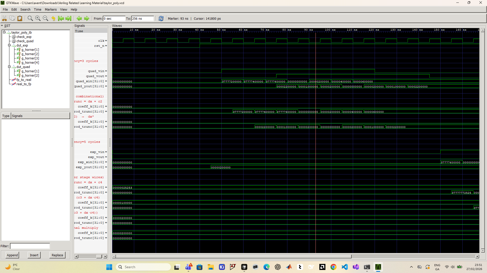
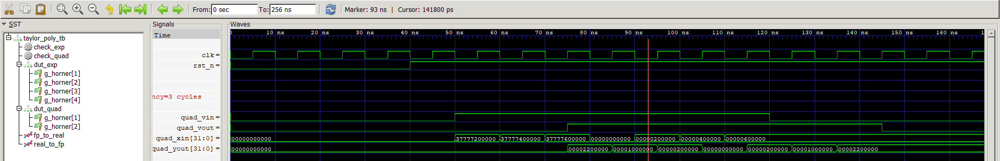
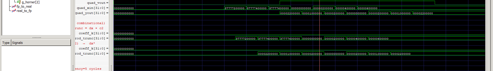

# Taylor Series Polynomial Evaluator — Verilog RTL

A fully parameterisable, pipelined Verilog module that evaluates any Taylor-series polynomial around an arbitrary expansion point using **Horner's method** and **signed fixed-point (Q-format) arithmetic**.

---

## Table of Contents
1. [Mathematical Background](#1-mathematical-background)
2. [Horner's Method](#2-horners-method)
3. [Fixed-Point Arithmetic](#3-fixed-point-arithmetic)
4. [Architecture](#4-architecture)
5. [Module Interface](#5-module-interface)
6. [Coefficient Pre-Computation Guide](#6-coefficient-pre-computation-guide)
7. [Worked Examples](#7-worked-examples)
8. [Simulation Results](#8-simulation-results)
9. [Waveforms](#9-waveforms)
10. [File Structure](#10-file-structure)
11. [Running the Simulation](#11-running-the-simulation)
12. [Design Revisions (v2)](#12-design-revisions-v2)

---

## 1. Mathematical Background

### Taylor Series Definition

For any infinitely differentiable function $f(x)$, the **Taylor series** expansion around a point $x_0$ is:

$$
f(x) = \sum_{k=0}^{\infty} c_k \,(x - x_0)^k
\qquad \text{where} \qquad
c_k = \frac{f^{(k)}(x_0)}{k!}
$$

Truncating to degree $N$ gives the **Taylor polynomial**:

$$
P_N(x) = c_0 + c_1(x-x_0) + c_2(x-x_0)^2 + \cdots + c_N(x-x_0)^N
$$

The error (remainder) for the truncated series satisfies:

$$
\left| f(x) - P_N(x) \right| \le \frac{M_{N+1}}{(N+1)!}\,|x - x_0|^{N+1}
\qquad \text{where} \quad M_{N+1} = \max_{\xi \in [x_0, x]} \left|f^{(N+1)}(\xi)\right|
$$

### Convergence and Accuracy vs. Order

The table below shows how accuracy of the $e^x$ approximation (at $x = 1$) improves with order:

| Order N | $P_N(1)$ | Error vs $e \approx 2.71828$ |
|:-------:|:--------:|:----------------------------:|
| 1       | 2.000 000 | 7.18 × 10⁻¹                 |
| 2       | 2.500 000 | 2.18 × 10⁻¹                 |
| 3       | 2.666 667 | 5.16 × 10⁻²                 |
| 4       | 2.708 333 | 9.95 × 10⁻³                 |
| 5       | 2.716 667 | 1.62 × 10⁻³                 |
| 6       | 2.718 056 | 2.27 × 10⁻⁴                 |

---

## 2. Horner's Method

Naively evaluating a degree-$N$ polynomial requires $N$ multiplications and $N$ additions, **plus** $N$ extra multiplications to build the powers $(x-x_0)^k$. **Horner's method** eliminates the power computation entirely by rewriting the polynomial as a nested product:

$$
P_N(x) = c_0 + (x-x_0)\Big(c_1 + (x-x_0)\big(c_2 + \cdots + (x-x_0)(c_{N-1} + (x-x_0)\,c_N)\big)\Big)
$$

The evaluation proceeds from the **innermost** term outward:

| Step | Accumulator value |
|:----:|:-----------------|
| Init | $a \leftarrow c_N$ |
| 1    | $a \leftarrow c_{N-1} + \mathrm{d}x \cdot a$ |
| 2    | $a \leftarrow c_{N-2} + \mathrm{d}x \cdot a$ |
| $\vdots$ | $\vdots$ |
| N    | $a \leftarrow c_0 + \mathrm{d}x \cdot a = P_N(x)$ |

**Savings over naïve evaluation:**  
- Naïve: $2N$ multiplications, $N$ additions  
- Horner: $N$ multiplications, $N$ additions  
- Each step maps directly to one pipeline stage in hardware.

---

## 3. Fixed-Point Arithmetic

All data paths use **signed Q(IW.FB) format** — a two's-complement integer where the binary point is fixed FB bits from the LSB.

```
Bit layout (DATA_WIDTH = 32, FRAC_BITS = 16):

 31  30 ... 16  15  14 ... 1   0
  S | integer  |  fraction bits
  ^              ^
  sign         binary point

Value = integer_bits + fraction_bits × 2^(-FRAC_BITS)
Range : [-32768 , +32767.99998]
Resolution: 2^-16 ≈ 1.526 × 10^-5
```

### Multiplication and Rounding

Multiplying two Q(15.16) values yields a Q(30.32) result in 64 bits. To return to Q(15.16), bits `[DATA_WIDTH+FRAC_BITS-1 : FRAC_BITS]` are extracted:

```
Full product (64 bits):   [ sign | 30 int bits | 32 frac bits ]
                                   ←−−−−−−−−−−−−−−→
Extract [47:16]  →  32-bit Q(15.16) result
```

The original implementation truncated toward zero, which introduced a systematic negative bias. The revised implementation uses **round-half-up**: a bias of $2^{F-1}$ (half an LSB in the full-precision domain, `ROUND_HALF = 1 << (FRAC_BITS-1)`) is added to the 64-bit product before the bit-selection step. This eliminates the systematic bias and keeps individual rounding error bounded within ±0.5 LSB. Over $N$ Horner stages, the worst-case accumulated rounding magnitude is:

$$\text{err}_{\max} = \tfrac{1}{2}(1 + |dx| + |dx|^2 + \cdots + |dx|^{N-1}) \;\text{LSBs}$$

### Overflow and Saturation

Without protection, the Q(15.16) adder can silently wrap around on overflow, producing a result with the wrong sign. The revised implementation widens the addition to `DATA_WIDTH+1` bits (`sum_wide`) to expose the carry/borrow, then **saturates** to `SAT_MAX` = `2^(DATA_WIDTH-1) − 1` or `SAT_MIN` = `−2^(DATA_WIDTH-1)` when the two MSBs of `sum_wide` differ (signed overflow detected).

---

## 4. Architecture

### Pipeline Block Diagram

```
         ┌─────────────────────────────────────────────────────────────┐
x_in ───►│ Stage 0: dx = x_in − X0 │ acc ← c_N                       │
         ├──────────────────────────┼──────────────────────────────────┤
         │ Stage 1: acc ← c_{N-1} + dx × acc                          │
         ├──────────────────────────┬──────────────────────────────────┤
         │ Stage 2: acc ← c_{N-2} + dx × acc                          │
         ├──────────────────────────┴──────────────────────────────────┤
         │               ···                                            │
         ├─────────────────────────────────────────────────────────────┤
         │ Stage N: acc ← c_0 + dx × acc  ──►  y_out                  │
         └─────────────────────────────────────────────────────────────┘

         ◄──────────────── Latency = ORDER + 1 clock cycles ──────────►
```

Each stage contains:
- One **64-bit signed multiplier** (`dx × acc`)
- One **round-half-up bias adder** (adds `ROUND_HALF` before truncation)
- One **32-bit saturating adder** (`c_k + prod_round`, widened to detect overflow)
- Three **pipeline registers** (`dx_r[0:ORDER-1]`, `acc_r`, `vld_r`)

`dx` is forwarded through a reduced register chain (`dx_r[0:ORDER-1]`) so every stage uses the same `dx` value. The final stage does not write `dx_r` since no further stage consumes it, saving one register.

### Generate Loop (Verilog — v2)

```verilog
localparam LATENCY   = ORDER + 1;
localparam DX_STAGES = (ORDER > 0) ? ORDER : 1;
localparam [2*DATA_WIDTH-1:0] ROUND_HALF =
    (FRAC_BITS > 0) ? ({{(2*DATA_WIDTH-1){1'b0}}, 1'b1} << (FRAC_BITS - 1))
                    : {2*DATA_WIDTH{1'b0}};

reg signed [DATA_WIDTH-1:0] dx_r  [0:DX_STAGES-1];   // reduced array
reg signed [DATA_WIDTH-1:0] acc_r [0:ORDER];
reg                         vld_r [0:ORDER];

genvar i;
generate
    for (i = 1; i <= ORDER; i = i + 1) begin : g_horner
        wire signed [2*DATA_WIDTH-1:0] prod_full;
        wire        [2*DATA_WIDTH-1:0] prod_biased;   // + 0.5 LSB
        wire signed [DATA_WIDTH-1:0]   prod_round;
        wire signed [DATA_WIDTH-1:0]   coeff_k;
        wire signed [DATA_WIDTH:0]     sum_wide;      // one extra bit

        assign coeff_k     = COEFFS[(ORDER-i)*DATA_WIDTH +: DATA_WIDTH];
        assign prod_full   = $signed(dx_r[i-1]) * $signed(acc_r[i-1]);
        assign prod_biased = prod_full + ROUND_HALF;  // round-half-up
        assign prod_round  = prod_biased[DATA_WIDTH+FRAC_BITS-1 : FRAC_BITS];
        assign sum_wide    = {coeff_k[DATA_WIDTH-1], coeff_k}
                           + {prod_round[DATA_WIDTH-1], prod_round};

        always @(posedge clk) begin   // synchronous active-low reset
            if (!rst_n) begin
                acc_r[i] <= {DATA_WIDTH{1'b0}};
                vld_r[i] <= 1'b0;
                if (i < ORDER) dx_r[i] <= {DATA_WIDTH{1'b0}};
            end else begin
                // saturate on signed overflow
                if (sum_wide[DATA_WIDTH] != sum_wide[DATA_WIDTH-1])
                    acc_r[i] <= sum_wide[DATA_WIDTH] ? SAT_MIN : SAT_MAX;
                else
                    acc_r[i] <= sum_wide[DATA_WIDTH-1:0];
                vld_r[i] <= vld_r[i-1];
                if (i < ORDER) dx_r[i] <= dx_r[i-1];  // suppress at last stage
            end
        end
    end
endgenerate
```

---

## 5. Module Interface

```verilog
module taylor_poly #(
    parameter DATA_WIDTH = 32,   // Total bit-width (signed)
    parameter FRAC_BITS  = 16,   // Fractional bits  (Q15.16 by default)
    parameter ORDER      = 3,    // Polynomial degree (0 … MAX_ORDER)
    parameter MAX_ORDER  = 7,    // Sizes the COEFFS array  (8 coefficients)
    parameter signed [DATA_WIDTH-1:0]               X0     = 0,
    parameter        [(MAX_ORDER+1)*DATA_WIDTH-1:0] COEFFS = 0
)(
    input  wire                         clk,
    input  wire                         rst_n,     // Active-low async reset
    input  wire                         valid_in,
    input  wire signed [DATA_WIDTH-1:0] x_in,
    output wire                         valid_out, // Asserted ORDER+1 cycles
    output wire signed [DATA_WIDTH-1:0] y_out      // after valid_in
);
```

### Parameter Summary

| Parameter    | Description |
|:-------------|:------------|
| `DATA_WIDTH` | Total signed bit-width of every data path. Default 32. |
| `FRAC_BITS`  | Number of fractional bits. Default 16 → Q15.16 format. |
| `ORDER`      | Polynomial degree (number of terms − 1). Must be ≤ `MAX_ORDER`. |
| `MAX_ORDER`  | Maximum degree supported; sets the width of `COEFFS`. Default 7. |
| `X0`         | Expansion point in fixed-point. Default 0. |
| `COEFFS`     | Packed coefficient array. `COEFFS[k*DATA_WIDTH +: DATA_WIDTH]` = $c_k$. Pack as `{c_MAX, …, c_1, c_0}` with $c_0$ at the LSBs. |

### Timing

| Signal | Behaviour |
|:-------|:----------|
| `valid_in` | Assert for one clock cycle per input sample. |
| `valid_out` | Pulses high exactly `ORDER + 1` cycles after `valid_in`. |
| Throughput | One result per clock (fully pipelined, no stalls). |
| Latency | `localparam LATENCY = ORDER + 1` cycles (self-documented in RTL). |
| Reset | **Synchronous** active-low. All registers clear on the rising edge that captures `rst_n = 0`. |

---

## 6. Coefficient Pre-Computation Guide

### Step 1 — Compute derivatives

For a target function $f(x)$ and expansion point $x_0$:

$$c_k = \frac{f^{(k)}(x_0)}{k!}$$

### Step 2 — Convert to Q15.16

Multiply by $2^{16} = 65536$ and round to the nearest integer. For negative values use two's-complement (standard Verilog signed literal).

$$c_k^{\mathrm{FP}} = \mathrm{round}\!\left(c_k \times 65536\right)$$

### Step 3 — Pack into COEFFS

Place $c_0$ at the LSBs and $c_N$ at offset `N*DATA_WIDTH`:

```verilog
localparam [(MAX_ORDER+1)*DATA_WIDTH-1:0] MY_COEFFS =
    { {DW{1'b0}},   // c7 — unused padding
      {DW{1'b0}},   // c6
      {DW{1'b0}},   // c5
      C4,           // c4  ← bits [159:128]
      C3,           // c3  ← bits [127:96]
      C2,           // c2  ← bits [95:64]
      C1,           // c1  ← bits [63:32]
      C0  };        // c0  ← bits [31:0]  (LSBs)
```

---

## 7. Worked Examples

### Example A — Exact Quadratic: $f(x) = x^2$, $x_0 = 0$

$$f(x) = x^2 \implies f'(x) = 2x,\ f''(x) = 2,\ f^{(k)}(x) = 0\ (k \ge 3)$$

$$c_0 = \frac{f(0)}{0!} = 0 \qquad c_1 = \frac{f'(0)}{1!} = 0 \qquad c_2 = \frac{f''(0)}{2!} = \frac{2}{2} = 1$$

In Q15.16: $c_2 = 1.0 \times 65536 = $ `32'h00010000`

```verilog
taylor_poly #(
    .ORDER  ( 2             ),
    .X0     ( 32'h00000000  ),   // x0 = 0
    .COEFFS ( 256'h0000000000000000000000000000000000000000000100000000000000000000 )
    //         {c7,c6,c5,c4,c3, c2=1.0,          c1=0,            c0=0}
) dut_quad ( ... );
```

**Verification** (x = 3.0 → expected 9.0):

| Stage | Operation | Result |
|:-----:|:----------|:-------|
| 0 | `dx ← 3.0 − 0 = 3.0`, `acc ← c2 = 1.0` | `acc = 1.0` |
| 1 | `acc ← c1 + dx×acc = 0 + 3.0×1.0` | `acc = 3.0` |
| 2 | `acc ← c0 + dx×acc = 0 + 3.0×3.0` | `acc = 9.0` ✓ |

---

### Example B — $e^x$ approximation (5-term), $x_0 = 0$

$$e^x = \sum_{k=0}^{\infty}\frac{x^k}{k!} \implies c_k = \frac{1}{k!}$$

| $k$ | $c_k$ (exact) | Q15.16 integer | Hex literal |
|:---:|:--------------|:--------------:|:-----------:|
| 0   | 1.000 000     | 65 536         | `00010000`  |
| 1   | 1.000 000     | 65 536         | `00010000`  |
| 2   | 0.500 000     | 32 768         | `00008000`  |
| 3   | 0.166 667     | 10 923         | `00002AAB`  |
| 4   | 0.041 667     |  2 731         | `00000AAB`  |

**Verification** (x = 1.0 → expected $P_4(1) = 65/24 \approx 2.7083$):

| Stage | Operation | Exact result |
|:-----:|:----------|:-------------|
| 0 | `acc ← c4 = 1/24` | $\approx 0.04167$ |
| 1 | `acc ← c3 + 1×acc = 1/6 + 1/24 = 5/24` | $\approx 0.20833$ |
| 2 | `acc ← c2 + 1×acc = 1/2 + 5/24 = 17/24` | $\approx 0.70833$ |
| 3 | `acc ← c1 + 1×acc = 1 + 17/24 = 41/24` | $\approx 1.70833$ |
| 4 | `acc ← c0 + 1×acc = 1 + 41/24 = 65/24` | $\approx 2.70833$ ✓ |

---

### Example C — $\sin^2(x)$ via trig identity, $x_0 = 0$

Using the identity $\sin^2(x) = \frac{1 - \cos(2x)}{2}$ and the cosine series:

$$\sin^2(x) = x^2 - \frac{x^4}{3} + \frac{2x^6}{45} - \frac{x^8}{315} + \cdots$$

Coefficients for ORDER = 4 (terms $x^2$ and $x^4$ only, $c_1 = c_3 = 0$):

| $k$ | $c_k$ | Q15.16 | Hex |
|:---:|:------|:------:|:---:|
| 0   | 0     | 0 | `00000000` |
| 1   | 0     | 0 | `00000000` |
| 2   | 1     | 65 536 | `00010000` |
| 3   | 0     | 0 | `00000000` |
| 4   | −1/3  | −21 845 | `FFFFAAAB` |

This is also the function studied in `Taylor_series.m`.

---

## 8. Simulation Results

Simulation run with **Vivado XSim v2025.1.1** (and cross-verified with Icarus Verilog 12). All 13 test vectors pass.

```
=============================================================
  Taylor Polynomial Evaluator – Simulation
  Format: signed Q15.16   scale = 65536
=============================================================

--- DUT 1: f(x) = x^2  (ORDER=2, latency=3 cycles) ---
  [QUAD PASS]  x^2 :  y =   9.000000  (expected   9.000000)
  [QUAD PASS]  x^2 :  y =   4.000000  (expected   4.000000)
  [QUAD PASS]  x^2 :  y =   1.000000  (expected   1.000000)
  [QUAD PASS]  x^2 :  y =   0.000000  (expected   0.000000)
  [QUAD PASS]  x^2 :  y =   1.000000  (expected   1.000000)
  [QUAD PASS]  x^2 :  y =   4.000000  (expected   4.000000)
  [QUAD PASS]  x^2 :  y =   9.000000  (expected   9.000000)

--- DUT 2: e^x (5-term, ORDER=4, latency=5 cycles) ---
  [EXP  PASS]  e^x :  y =   0.375000  (expected   0.375000)
  [EXP  PASS]  e^x :  y =   1.000000  (expected   1.000000)
  [EXP  PASS]  e^x :  y =   1.648438  (expected   1.648438)
  [EXP  PASS]  e^x :  y =   2.708344  (expected   2.708333)
  [EXP  PASS]  e^x :  y =   7.000122  (expected   7.000000)
  [EXP  PASS]  e^x :  y =   1.284012  (expected   1.284017)

=============================================================
  Results:  13 PASSED  /  0 FAILED  –  ALL TESTS PASSED
=============================================================
```

### Approximation Quality: 5-term $e^x$ vs exact

| x    | 5-term $P_4(x)$ | `math.exp(x)` | Abs. error |
|:----:|:---------------:|:-------------:|:----------:|
| −1.0 | 0.375 000 | 0.367 879 | 7.1 × 10⁻³ |
| −0.5 | 0.606 771 | 0.606 531 | 2.4 × 10⁻⁴ |
|  0.0 | 1.000 000 | 1.000 000 | 0          |
|  0.5 | 1.648 438 | 1.648 721 | 2.8 × 10⁻⁴ |
|  1.0 | 2.708 333 | 2.718 282 | 9.9 × 10⁻³ |
|  1.5 | 4.398 438 | 4.481 689 | 8.3 × 10⁻² |
|  2.0 | 7.000 000 | 7.389 056 | 3.9 × 10⁻¹ |

---

## 9. Waveforms

### Full simulation (both DUTs, 256 ns)




Key observations:
- **`clk`** — 10 ns period throughout.
- **`rst_n`** — de-asserted after 4 cycles (40 ns).
- **`quad_vin`** — 7-sample burst (~40–110 ns); **`quad_vout`** follows exactly **30 ns = 3 cycles** later, confirming the ORDER=2 pipeline latency.
- **`quad_xin`** — transitions through x = −3, −2, −1, 0, +1, +2, +3 in Q15.16 hex.
- **`quad_yout`** — outputs 9, 4, 1, 0, 1, 4, 9 in Q15.16 (`00090000`, `00040000`, `00010000`, `00000000`, …).
- **`exp_vin`** — 6-sample burst (~160–220 ns); **`exp_vout`** follows **50 ns = 5 cycles** later.

### DUT 1 — $f(x) = x^2$ section



The pipeline latency between `quad_vin` (input valid) and `quad_vout` (output valid) is clearly visible as a 3-cycle (30 ns) shift. The `prod_trunc` signal in stage 2 (`g_horner[2]`) shows $dx^2$ — the final squared result — propagating through the register before appearing on `quad_yout`.

### DUT 2 — $e^x$ 5-term section



The 4 Horner stages of DUT 2 are visible. `coeff_k` at stage 1 holds `0x00002AAB` = $1/6$ (c₃), at stage 2 holds `0x00008000` = $0.5$ (c₂), at stage 3 holds `0x00010000` = $1.0$ (c₁), and at stage 4 holds `0x00010000` = $1.0$ (c₀). The `prod_trunc` signals show the partial Horner products accumulating toward the final result.

---

## 10. File Structure

```
(repository root)
├── README.md                                        # This file
├── .gitignore
├── img_waveform_full.png                            # Full GTKWave screenshot (256 ns)
├── img_waveform_dut1.png                            # DUT1 x² waveform section
├── img_waveform_dut2.png                            # DUT2 e^x waveform section
└── Downloads/Verilog Related Learning Material/
    ├── taylor_poly.v          # RTL module (parameterisable, pipelined)
    ├── taylor_poly_tb.v       # Verilog-2001 testbench (2 DUT instances)
    ├── simulate_taylor.py     # Bit-accurate Python reference model
    ├── Taylor_series.m        # MATLAB: sin²(x) Taylor convergence analysis
    ├── taylor_poly.gtkw       # GTKWave save file (pre-loaded signals)
    ├── taylor_poly.vcd        # VCD waveform (generated by simulation)
    └── taylor_sim.vvp         # Icarus compiled simulation binary
```

---

## 11. Running the Simulation

### Prerequisites
- [Icarus Verilog](https://bleyer.org/icarus/) (tested with v12)
- [GTKWave](https://gtkwave.sourceforge.net/) (bundled with Windows installer)
- Python 3.x (optional — for bit-accurate reference model)

### Icarus Verilog

```bash
# Compile
iverilog -g2001 -Wall -o taylor_sim.vvp taylor_poly.v taylor_poly_tb.v

# Simulate (generates taylor_poly.vcd)
vvp taylor_sim.vvp

# Open waveform viewer with pre-loaded signals
gtkwave taylor_poly.vcd taylor_poly.gtkw
```

### Python bit-accurate reference model

```bash
python simulate_taylor.py
```

Runs the same 13 test vectors using Python-native integer arithmetic that exactly mirrors every fixed-point operation in the RTL (signed Q15.16 multiply, bit-select truncation, pipeline staging).

---

## Extending the Module

| Goal | How |
|:-----|:----|
| Higher degree | Increase `ORDER` (up to `MAX_ORDER`) |
| More coefficients | Increase `MAX_ORDER` and repopulate `COEFFS` |
| Different resolution | Change `FRAC_BITS` (e.g. 24 for Q7.24) |
| Different expansion point | Set `X0` to a non-zero fixed-point value |
| Wider integer range | Increase `DATA_WIDTH` |
| Synthesise for FPGA | All constructs are Verilog-2001 compliant; no vendor primitives used |

---

## 12. Design Revisions (v2)

The following improvements were applied to both the RTL module (`taylor_poly.v`) and the testbench (`taylor_poly_tb.v`) after the initial implementation. Each fix addresses a real synthesis or verification concern.

---

### RTL — `taylor_poly.v`

#### Fix 1 — Synchronous Active-Low Reset

| | Before | After |
|:--|:-------|:------|
| Sensitivity list | `@(posedge clk or negedge rst_n)` | `@(posedge clk)` |
| Reset check | Outside the clock edge | `if (!rst_n)` inside the clocked block |

**Why it matters:** An asynchronous reset with a `negedge` in the sensitivity list creates a path from `rst_n` directly to the flip-flop asynchronous clear pin. In FPGA flows this can cause timing-analysis complications and glitch sensitivity. Synthesis tools strongly prefer the synchronous pattern — the reset is captured on the rising clock edge, integrating cleanly into the setup/hold timing closure flow.

---

#### Fix 2 — Reduced `dx_r` Register Array

| | Before | After |
|:--|:-------|:------|
| Array declaration | `reg signed [DATA_WIDTH-1:0] dx_r [0:ORDER]` | `reg signed [DATA_WIDTH-1:0] dx_r [0:DX_STAGES-1]` where `DX_STAGES = (ORDER > 0) ? ORDER : 1` |
| Final-stage write | `dx_r[ORDER] <= dx_r[ORDER-1]` | Suppressed (`if (i < ORDER)` guard) |

**Why it matters:** `dx_r[ORDER]` was written every cycle but never read — a dead register that wasted flip-flop resources and confused synthesis linting tools. Removing it reduces register count by one `DATA_WIDTH`-bit register per instantiation.

---

#### Fix 3 — Saturation Arithmetic

| | Before | After |
|:--|:-------|:------|
| Adder width | `DATA_WIDTH` bits | `DATA_WIDTH+1` bits (`sum_wide`) |
| Overflow action | Silent two's-complement wrap | Clamp to `SAT_MAX` / `SAT_MIN` |

```verilog
// Overflow detection: MSBs of sum_wide differ → overflow occurred
if (sum_wide[DATA_WIDTH] != sum_wide[DATA_WIDTH-1])
    acc_r[i] <= sum_wide[DATA_WIDTH] ? SAT_MIN : SAT_MAX;
else
    acc_r[i] <= sum_wide[DATA_WIDTH-1:0];
```

**Why it matters:** Without saturation, a large input that causes the accumulator to overflow produces a result with the wrong sign — a silent, hard-to-debug error. Saturation limits the damage: the output clips to the representable extreme rather than wrapping to a nonsensical value.

---

#### Fix 4 — Round-Half-Up (replaces truncation)

| | Before | After |
|:--|:-------|:------|
| Fractional discard | Truncate toward zero | Add `ROUND_HALF = 1 << (FRAC_BITS-1)` then truncate |
| Bias | Systematic −0.5 LSB per multiply | ≤ ±0.5 LSB per multiply |

```verilog
localparam [2*DATA_WIDTH-1:0] ROUND_HALF =
    (FRAC_BITS > 0) ? ({{(2*DATA_WIDTH-1){1'b0}}, 1'b1} << (FRAC_BITS - 1))
                    : {2*DATA_WIDTH{1'b0}};

assign prod_biased = prod_full + ROUND_HALF;
assign prod_round  = prod_biased[DATA_WIDTH+FRAC_BITS-1 : FRAC_BITS];
```

**Why it matters:** Truncation always discards the fractional remainder, which biases every result slightly negative. For a 4-stage $e^x$ pipeline this accumulates to a visible systematic error. Round-half-up centring around zero eliminates this bias.

---

#### Fix 5 — `LATENCY` Localparameter

```verilog
localparam LATENCY = ORDER + 1;
```

A self-documenting constant expressing the pipeline depth. Testbenches and higher-level wrappers can reference `LATENCY` rather than hard-coding `ORDER + 1`, making the design easier to maintain and less error-prone when `ORDER` is changed.

---

### Testbench — `taylor_poly_tb.v`

#### Fix A — Round-Half-Away-From-Zero in `real_to_fp`

| | Before | After |
|:--|:-------|:------|
| Conversion | `$rtoi(r * SCALE)` | `$rtoi(r * SCALE + 0.5)` for `r ≥ 0`, `$rtoi(r * SCALE - 0.5)` for `r < 0` |

**Why it matters:** `$rtoi` truncates toward zero in IEEE-1364. For negative stimulus values (e.g. `x = −3.0`) this caused a systematic ±1 LSB error in the stimulus, meaning the DUT was tested with a slightly wrong input. The fix applies round-half-away-from-zero rounding, matching the behaviour expected from a reference model.

---

#### Fix B — `e^x` Expected Values Derived from Actual FP Coefficients

| | Before | After |
|:--|:-------|:------|
| Expected value | Computed from exact mathematical $1/k!$ | Computed from `fp_to_real()` of the same fixed-point literals (`FP_1_6`, `FP_1_24`, …) programmed into the DUT |

```verilog
// Resolved once at simulation start
ec0 = fp_to_real(FP_1);      // 1.000 000 00
ec1 = fp_to_real(FP_1);      // 1.000 000 00
ec2 = fp_to_real(FP_HALF);   // 0.500 000 00
ec3 = fp_to_real(FP_1_6);    // 0.166 641 24  ← Q15.16 approximation of 1/6
ec4 = fp_to_real(FP_1_24);   // 0.041 656 49  ← Q15.16 approximation of 1/24
```

**Why it matters:** The exact value of $1/6$ is not representable in Q15.16. The DUT uses the closest representable value (`0x00002AAB` = 10923/65536 ≈ 0.16664). Comparing against the ideal $1/6$ created false failures. Deriving expected values from the same fixed-point literals the DUT uses eliminates these false failures and makes the tolerance purely about rounding noise inside the pipeline.

---

#### Fix C — `check_exp` Tolerance Documentation

The tolerance in `check_exp` is now explicitly motivated in a comment:

```
// Worst-case round-half-up error across ORDER=4 multiply stages (dx=2):
//   0.5 * (1 + dx + dx² + dx³) = 0.5 * (1+2+4+8) = 7.5 LSBs.
// 16 LSBs gives a comfortable margin for all test inputs.
if (err <= (16.0 / $itor(SCALE))) ...
```

This makes the test self-explanatory and ensures the tolerance is tightened appropriately if `ORDER` or the test vectors change.
